<h1 align="center">
-- DPR App --
</h1>

<!-- ## -- Screenshots -- -->

* ## ___Patient Login, Register, Home___

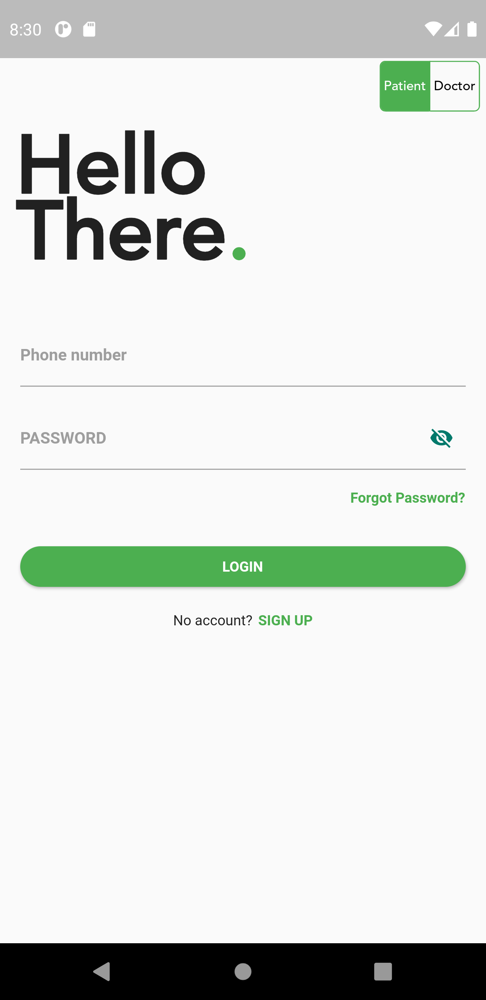
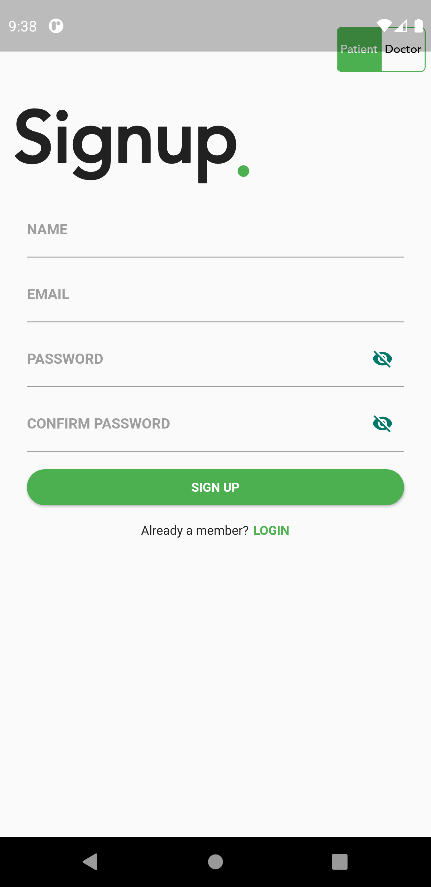
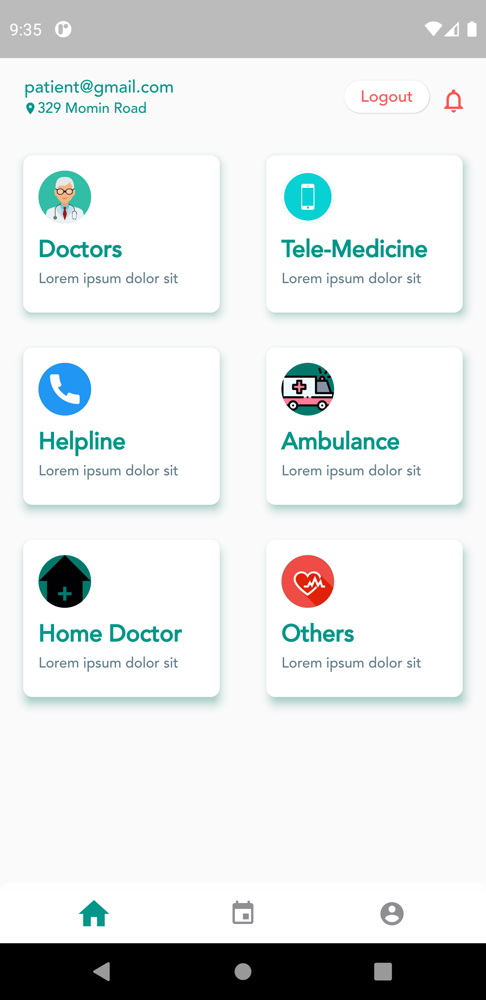
</ -->

* ## ___Patient- Doctor Search, Doctor Details, Make Appointment, Profile___

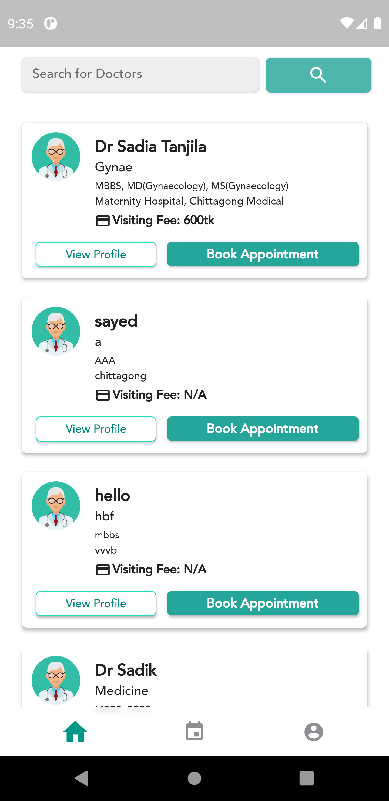
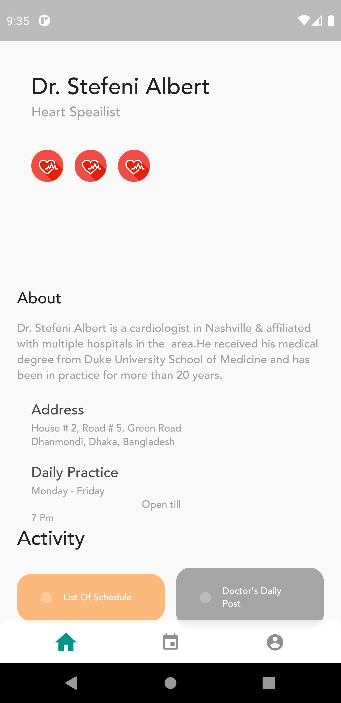

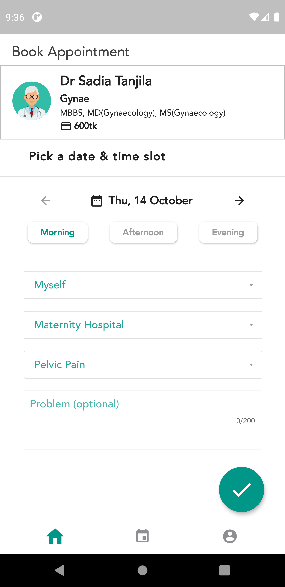
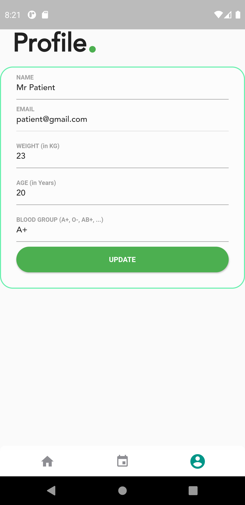

* ## ___Doctor Login, Register, Appointment List, Monthly overview___

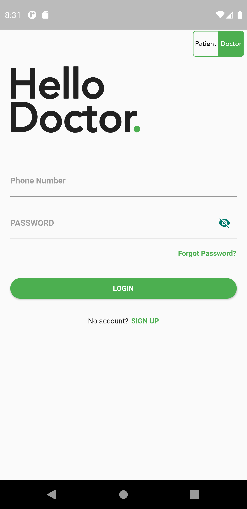
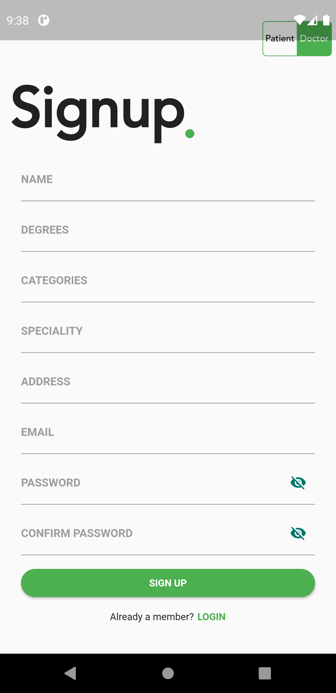
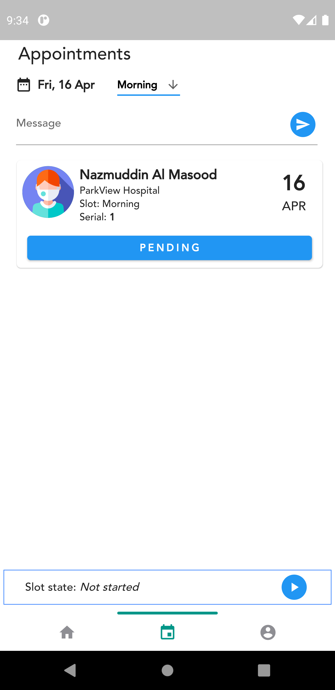
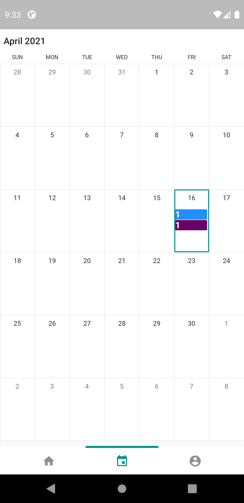

